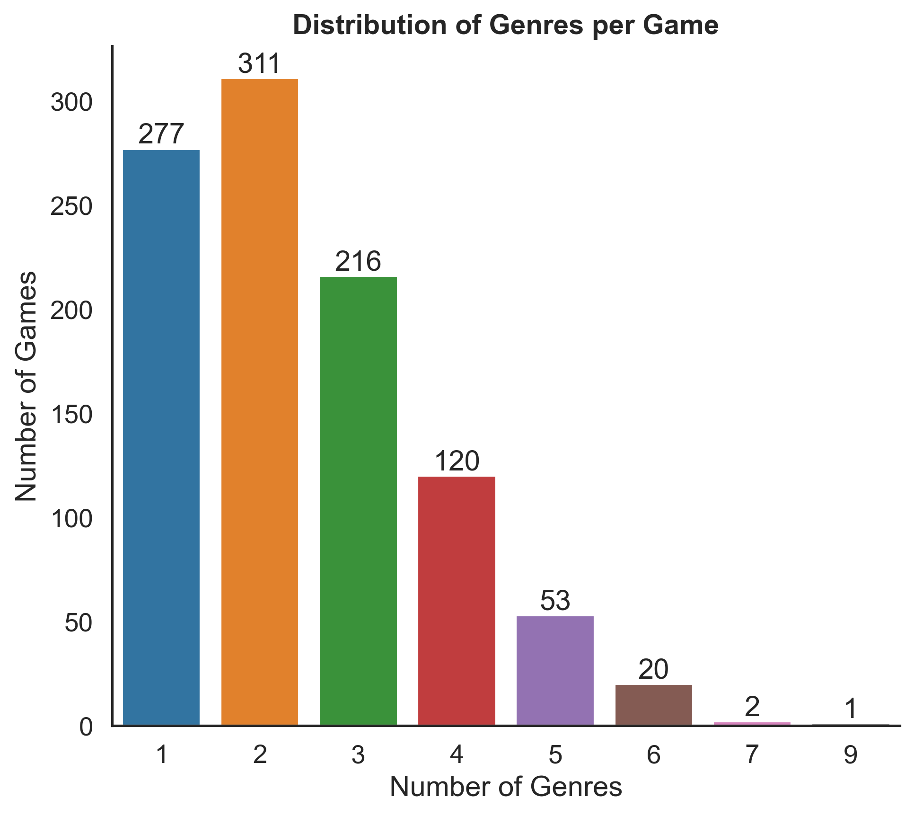
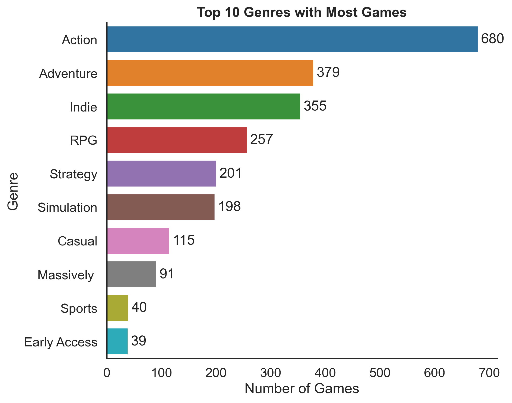
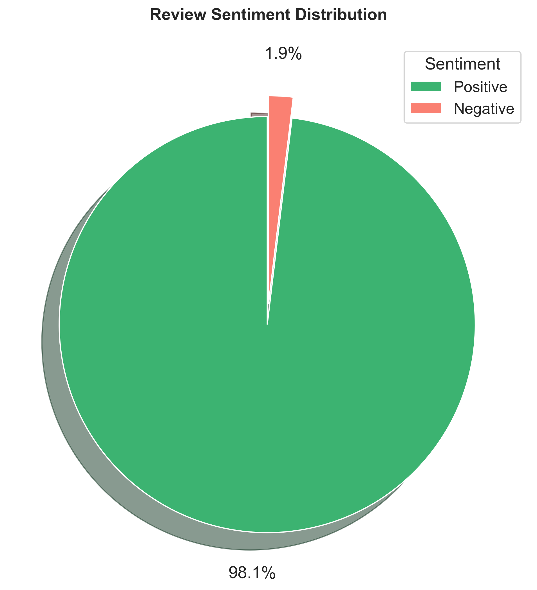
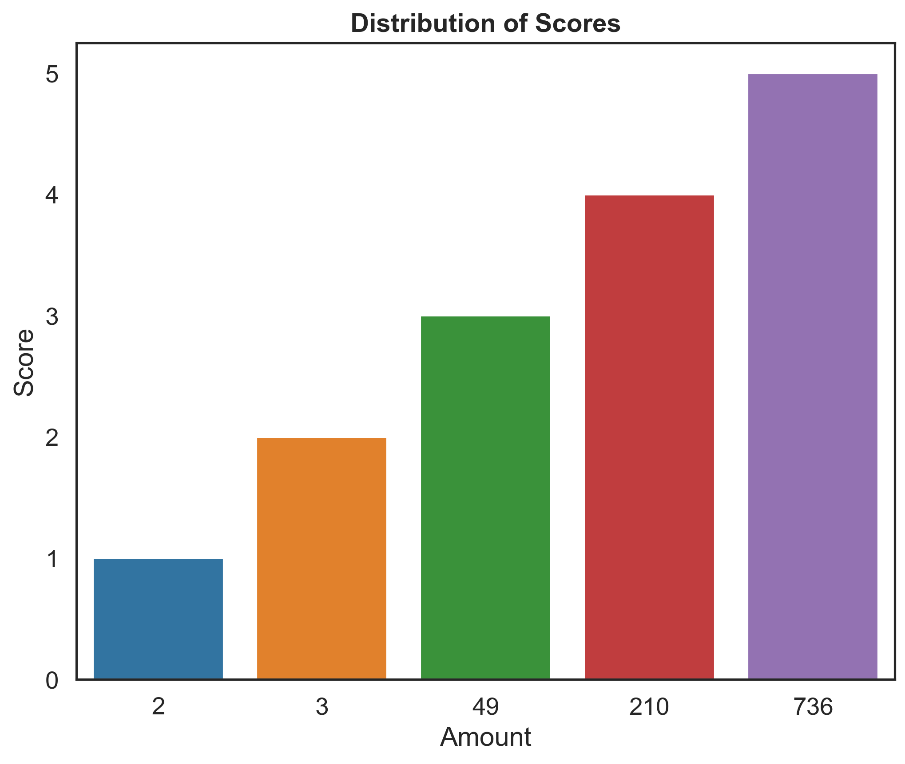
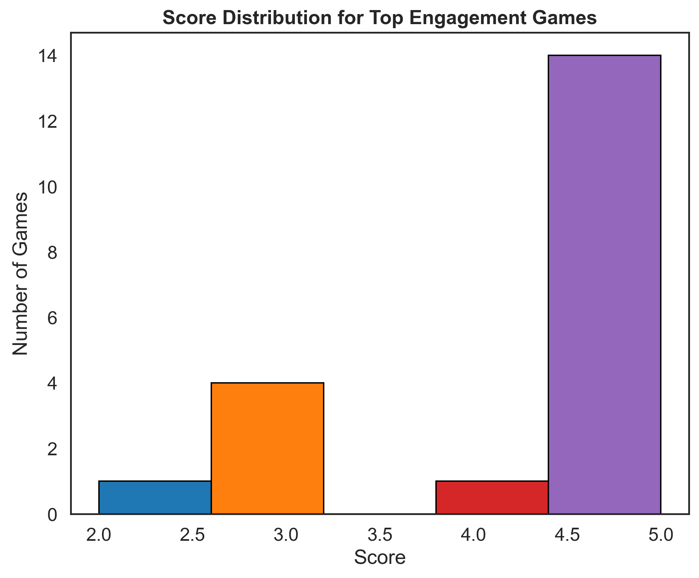

# STEAMCB – Game Analysis & Recommendation System

With the continuous growth in the number of video games across different genres and categories, it becomes increasingly difficult for users to explore and evaluate all available options. As a result, selecting a game that aligns with personal preferences can be time-consuming and inefficient.

SteamCB is a data analysis project aimed at understanding patterns in video game characteristics and user feedback, with the final goal of developing a content-based recommendation system. This system will help users discover games based on similarities between game features and user preferences.

The project explores variables such as genres, engagement metrics, sentiment, and user ratings to identify meaningful patterns that can later be used for building a recommendation model.

(Here an image of the application / model output will be inserted once available)

The system computes similarity between games using feature-based representations and returns ranked recommendations based on user-defined preferences.

## Project Organization:
````
SteamCB/
├── data/                          # Project data folder
│   ├── raw/                       # Original, unprocessed data
│   ├── processed/                # Cleaned and transformed data
│
├── Media/                        # Graphs and visualizations (Figures 1–5)
│   ├── gender_distribution_per_game.png
│   ├── scores_by_engagement.png
│   ├── scores_distribution.png
│   ├── sentiment_distribution.png
│   ├── top10_genres_most_games.png
│
├── Notebooks/                    # Jupyter notebooks for analysis
│   ├── steam_data_extraction_tables.ipynb
│   ├── steam_EDA.ipynb
│
├── scripts/                      # Data processing and logic scripts
│   ├── __pycache__/              # Python cache files (auto-generated)
│   ├── fetch_steamspy.py        # Script to extract data from SteamSpy
│
├── Tables/                       # Extracted or processed datasets
│   ├── subtable_genrerxappid.csv
│   ├── table_games.csv
│   ├── table_genrer.csv
│   ├── table_review.csv
│
├── .gitignore                   # Git ignored files configuration
├── README.md                    # Main project documentation
└── requirements.txt             # Project dependencies

````
## Analysis

### Gender Distribution

In Figure 1, the distribution of the number of genres per game is shown.

<p align="center">  </p> <p align="center"><em>Figure 1: Genre distribution per game</em></p>

Most games are associated with 1 to 3 genres, with a higher concentration in titles that combine at least two. As the number of genres per game increases, their frequency decreases significantly.

This suggests that games tend to focus on a limited number of genres, likely to maintain a clear identity and avoid overly fragmented gameplay experiences.

In Figure 2, genre popularity is analyzed in terms of engagement.

<p align="center">  </p> <p align="center"><em>Figure 2: Top genres by engagement</em></p>

Genres such as Action and Adventure stand out significantly above the rest, indicating a higher level of user preference and engagement.

This behavior suggests that more dynamic and action-oriented genres tend to generate higher interaction levels compared to more niche or specialized categories.

In Figure 3, the distribution of positive and negative reviews is presented.

<p align="center">  </p> <p align="center"><em>Figure 3: Sentiment distribution of reviews</em></p>

A clear predominance of positive reviews over negative ones can be observed, suggesting that users generally evaluate the analyzed games favorably.

This result indicates an overall positive sentiment within the dataset, although it does not imply that all individual games follow the same pattern.

### Rating Distribution

In Figure 4, the distribution of user scores is shown.

<p align="center">  </p> <p align="center"><em>Figure 4: Score distribution</em></p>

The score distribution reinforces the pattern observed in the sentiment analysis, with a higher concentration of values in the upper range. This suggests that user evaluations are generally positive and consistent with the sentiment results.


In Figure 5, the distribution of user ratings is presented.

<p align="center">  </p> <p align="center"><em>Figure 5: Rating distribution</em></p>

Most ratings are concentrated in the mid-to-high range (primarily between 3 and 5 stars), while low ratings are significantly less frequent.

This suggests that users who submit reviews tend to report generally positive or neutral experiences, with extreme negative evaluations being less common.

Low ratings appear infrequently in the dataset, indicating that only a small proportion of users report strongly negative experiences with the analyzed games.


## Conclusion

Overall, the analysis reveals consistent patterns across genres, engagement, sentiment, and user ratings.

Games tend to be concentrated in a small number of genres, suggesting that developers often prioritize a focused genre identity rather than combining a large variety of categories. Within this context, Action and Adventure emerge as the most prominent and engaging genres, indicating a higher level of user interest and play activity in more dynamic gameplay experiences.

Sentiment analysis shows a clear predominance of positive reviews over negative ones, which is also reflected in the score distribution, where higher values are more frequent. This suggests that the overall perception of the analyzed games is generally favorable.

Regarding ratings, most values are concentrated in the mid-to-high range (3 to 5 stars), indicating that users rarely provide extreme negative evaluations. Low ratings appear less frequently, which may reflect isolated cases of dissatisfaction rather than a dominant pattern across the dataset.

Finally, while lower ratings and negative reviews can indicate dissatisfaction in specific cases, they should not be interpreted in isolation as a direct measure of overall game quality or recommendation value. Instead, they represent one component of a broader user perception landscape.

This pattern may be associated with specific cases of dissatisfaction; however, the underlying causes cannot be determined solely from the rating distribution. insatisfacción; sin embargo, no es posible determinar las causas exactas únicamente a partir de la distribución de ratings.
